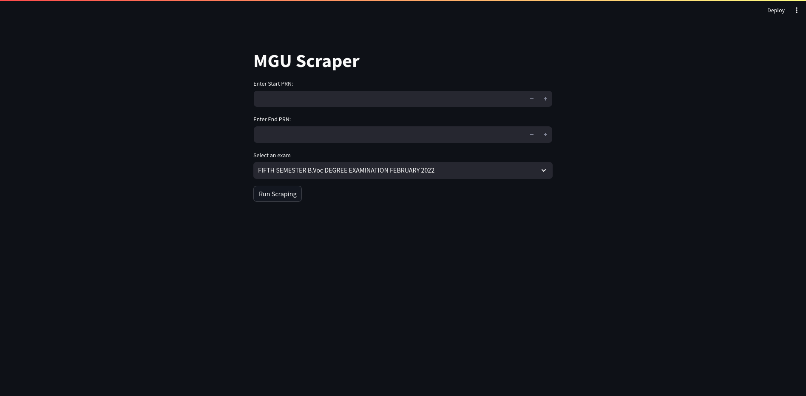

# MGU Scraper

MGU Scraper is exclusively tailored to streamline the extraction of grade results specific to MGU University. This tool generates results in a user-friendly CSV format, ensuring a hassle-free process for importation into your preferred spreadsheet program.



## Getting Started:
Clone it: 
```bash
git clone https://github.com/shonebinu/MGUScraper.git && cd MGUScraper
```
Grab the tools: 
```bash
pip install -r requirements.txt
```
Fire it up: 
```bash
streamlit run app_streamlit.py
```

### Website Access:
Visit [MGUScraper](https://mguscraper.streamlit.app) for an alternative way to use MGU Scraper

## How to Use:
1. Plug in your start and end register numbers.
2. Choose the exam.
3. Hit 'Run Scraping' let MGUScraper handle the rest.
4. Download the csv file.

## To-Do:

